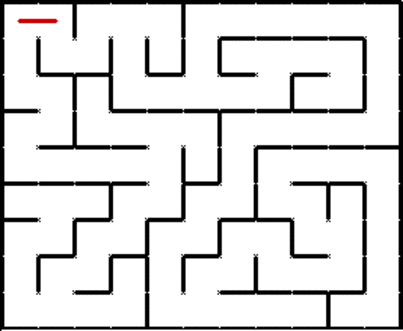

# Path_Finding-Breadth_First_Search_Algorithm_BFS

The project implements the breadth first search algorithm to traverse and find the shortest path out of a maze 2D

Breadth-first search is an uninformed algorithm, it blindly searches toward a goal on the breadth. BFS starts from an initial node (start) and expands neighbor nodes on the breadth, this is implemented by using a FIFO-queue (First In First Out).
